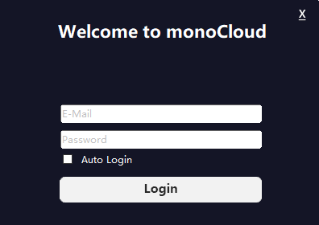
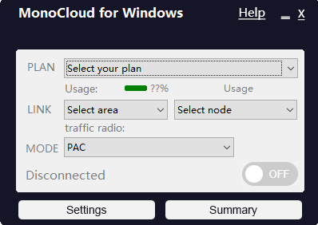
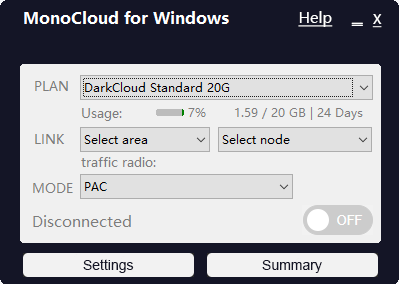
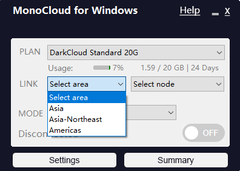
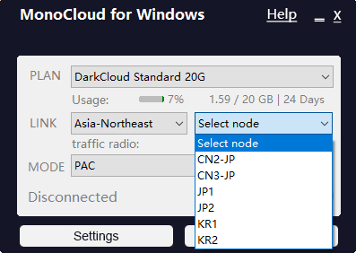
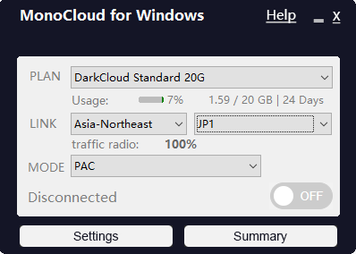
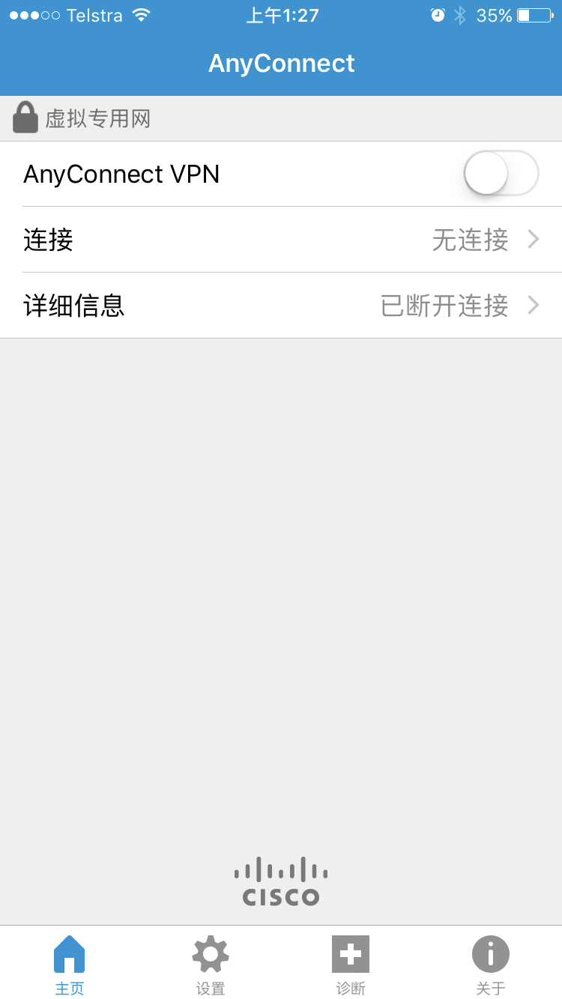
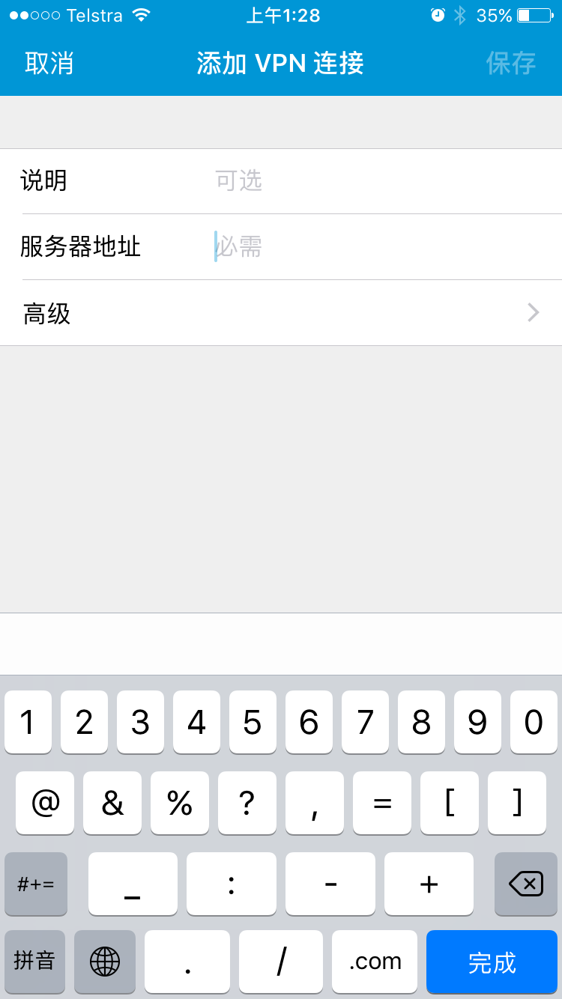
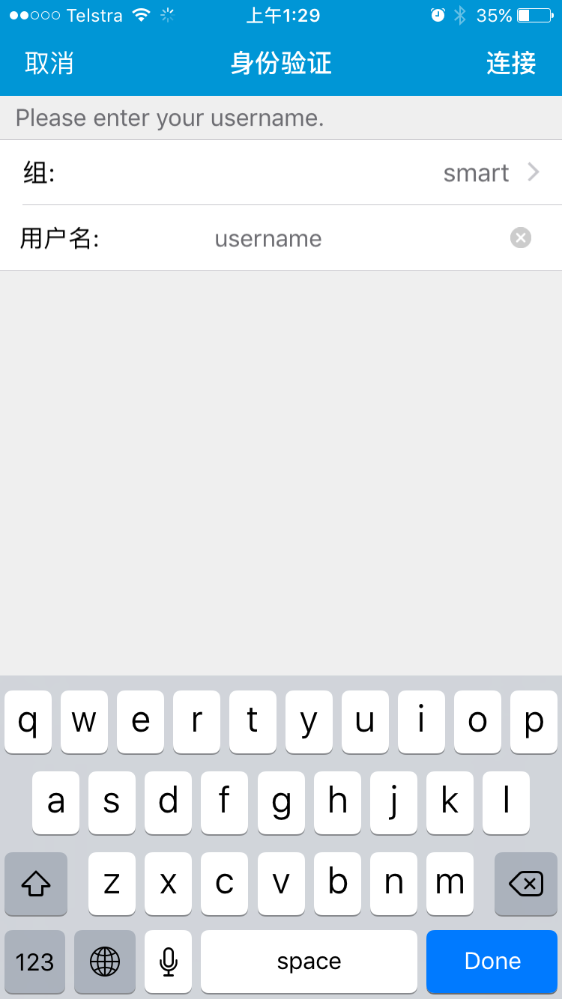
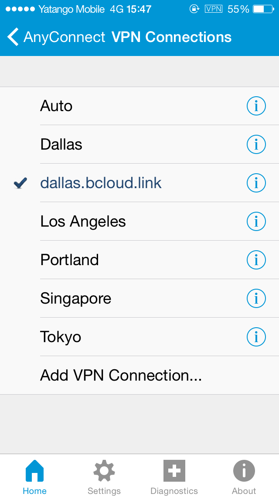

# Monocloud 使用说明书
Instruction of monocloud client for windows &amp; mobile phone.

## 在 Windows 中使用
**Monocloud客户端**

1.下载Monocloud客户端，解压并打开运行

下载地址：

[Monocloud_client](https://storage.monocloud.co/client/Windows/MonoCloud_V1.0.6.zip)

如果下载后无法运行，安装[Microsoft.NET Framework 4.6](https://www.microsoft.com/zh-CN/download/details.aspx?id=53345)后重试

2.运行后，输入**登录邮箱**和密码（不是用户名），可选 **Auto Login**记住密码下次自动登陆

3.登陆后来到以下界面

4.选择套餐（这里是 Classic B)

5.LINK中选择地区

6.选择节点

7.MODE选择代理模式，GLOBAL为全局模式，不知道选什么则选择PAC

8.点击灰色按钮，连接成功后客户端自动缩小到任务栏。完成！

## 在 IOS 中使用

1.点击连接 [AnyConnect点我](https://apps.apple.com/us/app/cisco-anyconnect/id1135064690)并下载安装。

（或在AppStore中搜索 AnyConnect 并下载安装，可能需要美区AppleID）

2.打开AnyConnect，点击**连接/Connectino**，添加VPN链接

3.点击**添加 VPN 连接...**

4.在下面的地址中选择一个填入**服务器地址/Server Address**：

> fmt1.link.ac.cn 或 eu1.link.ac.cn 或 tw1.link.ac.cn 或 hk1.link.ac.cn

5.返回主界面，点击开关连接VPN，并输入**用户名**和密码

6.断开连接之后即可在首页 **连接/Connection** 中看到服务器列表，如果觉得节点速度较慢可以尝试更换服务器

7.AnyConnect无法记住密码，所以每次登陆都需要手动输入。可以选择OpenConnect或者IOS客户端
