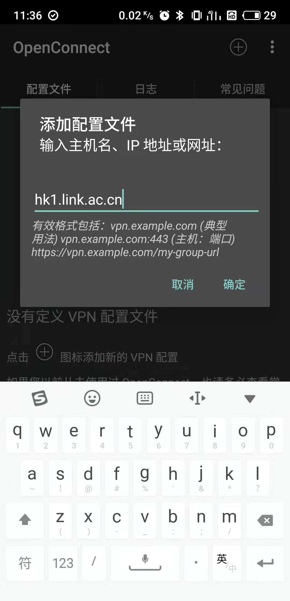

# Monocloud 使用说明书
+ [在Windows中使用](https://github.com/1874yin/monocloud-usage/blob/master/README.md#%E5%9C%A8-windows-%E4%B8%AD%E4%BD%BF%E7%94%A8)
+ [在IOS中使用](https://github.com/1874yin/monocloud-usage/blob/master/README.md#%E5%9C%A8-ios-%E4%B8%AD%E4%BD%BF%E7%94%A8 )
+ [在Android中使用](https://github.com/1874yin/monocloud-usage/blob/master/README.md#%E5%9C%A8-android-%E4%B8%AD%E4%BD%BF%E7%94%A8)

## 在 Windows 中使用
**Monocloud客户端**

1.下载Monocloud客户端，运行exe文件

下载地址：

> [Monocloud_client](https://storage.monocloud.co/client/Windows/MonoCloud_V1.0.6.zip)

如果下载后无法运行，安装

> [Microsoft.NET Framework 4.6](https://www.microsoft.com/zh-CN/download/details.aspx?id=53345)

2.运行后，输入**登录邮箱**和密码（不是用户名），可选 **Auto Login**记住密码下次自动登陆

3.登陆后来到以下界面

4.选择套餐（这里是 Classic B)

5.LINK中选择地区

6.选择节点

7.MODE选择代理模式，GLOBAL为全局模式，不知道选什么则选择PAC

8.点击灰色按钮，连接成功后客户端自动缩小到任务栏。完成！

## 在 IOS 中使用
**AnyConnect客户端**

1.点击连接 

> [AnyConnect](https://apps.apple.com/us/app/cisco-anyconnect/id1135064690) 

并下载安装（或在AppStore中搜索 AnyConnect,可能需要美区AppleID）

2.打开AnyConnect，点击**连接/Connection**，添加VPN链接

3.点击**添加 VPN 连接...**

4.在下面的地址中选择一个填入**服务器地址/Server Address**：

> fmt1.link.ac.cn 

> eu1.link.ac.cn 

> tw1.link.ac.cn 

> hk1.link.ac.cn

5.返回主界面，点击开关连接VPN，在弹出的界面输入**用户名**和密码，组默认为"smart"即可

6.断开连接之后可在 **连接/Connection** 中看到服务器列表，如果觉得节点速度较慢可以尝试更换服务器

7.AnyConnect无法记住密码，所以每次登陆都需要手动输入。可以选择OpenConnect或者IOS客户端

## 在 Android 中使用
**AnyConnect客户端**

1.下载 

> [AnyConnect](https://storage.monocloud.co/client/AnyConnect/AnyConnect.apk) 

2.参照 

> [在IOS中使用](https://github.com/1874yin/monocloud-usage/blob/master/README.md#%E5%9C%A8-ios-%E4%B8%AD%E4%BD%BF%E7%94%A8)
- - -
**OpenConnect客户端** (可选记住密码，不可更换节点）

1.下载 

> [OpenConnect](https://static.monocloud.co/client/anyconnect/app.openconnect.apk) 

2.点击 + 图标添加配置文件

3.从以下服务器中选择一个填入

> fmt1.link.ac.cn

> eu1.link.ac.cn 

> tw1.link.ac.cn 

> hk1.link.ac.cn

4.返回主界面，点击刚刚添加的节点

5.输入 **用户名** 和密码，确定完成！

6.可以将四个服务器地址都添加备用
