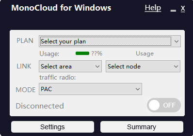
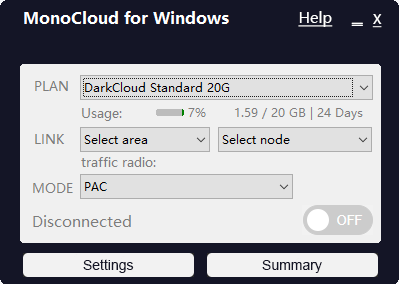
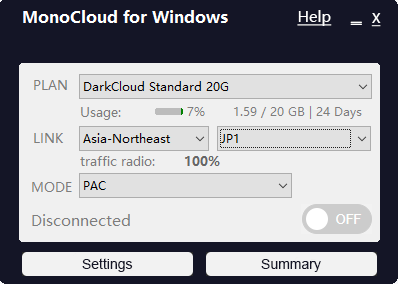

## 在 Windows 中使用
**Monocloud客户端**

1.下载Monocloud客户端，运行exe文件

下载地址：

> [Monocloud_client](https://storage.monocloud.co/client/Windows/MonoCloud_V1.0.6.zip)

如果下载后无法运行，安装

> [Microsoft.NET Framework 4.6](https://www.microsoft.com/zh-CN/download/details.aspx?id=53345)

2.运行后，输入**登录邮箱**和密码（不是用户名），可选 **Auto Login**记住密码下次自动登陆

3.登陆后来到以下界面

4.选择套餐（这里是 Classic B)

5.LINK中选择地区

6.选择节点

7.MODE选择代理模式，GLOBAL为全局模式，不知道选什么则选择PAC

8.点击灰色按钮，连接成功后客户端自动缩小到任务栏。完成！

查看更多

> [在IOS中使用](https://github.com/1874yin/monocloud-usage/blob/master/notes/2.%E5%9C%A8IOS%E4%B8%AD%E4%BD%BF%E7%94%A8.md )

> [在Android中使用](https://github.com/1874yin/monocloud-usage/blob/master/notes/3.%E5%9C%A8Android%E4%B8%AD%E4%BD%BF%E7%94%A8.md)
