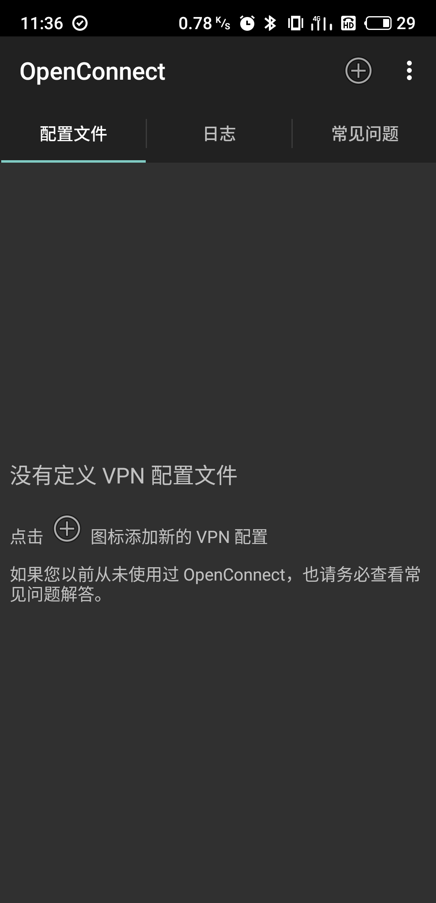
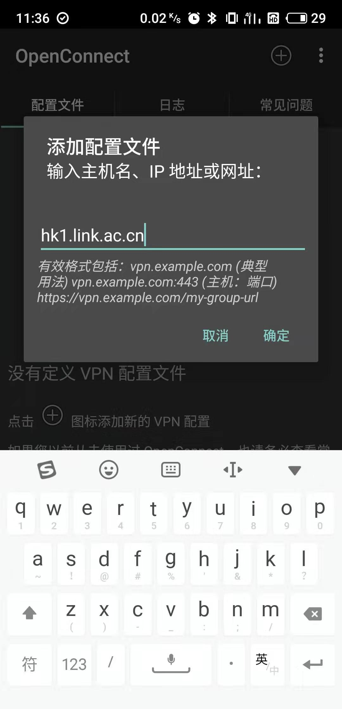
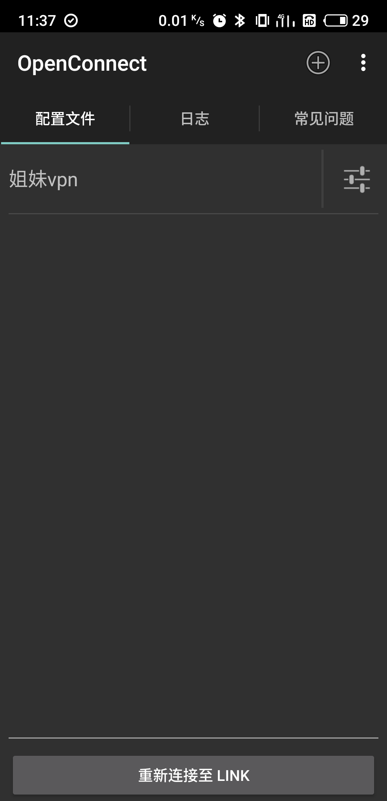
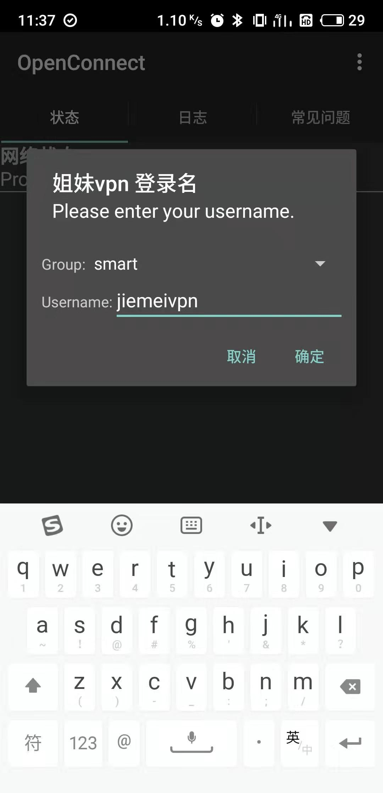

## 在 Android 中使用
**AnyConnect客户端**

1.下载 

> [AnyConnect](https://storage.monocloud.co/client/AnyConnect/AnyConnect.apk) 

2.参照 

> [在IOS中使用](https://github.com/1874yin/monocloud-usage/blob/master/README.md#%E5%9C%A8-ios-%E4%B8%AD%E4%BD%BF%E7%94%A8)
- - -
**OpenConnect客户端** (可选记住密码，不可更换节点）

1.下载 

> [OpenConnect](https://static.monocloud.co/client/anyconnect/app.openconnect.apk) 

2.点击 + 图标添加配置文件

3.从以下服务器中选择一个填入

> fmt1.link.ac.cn

> eu1.link.ac.cn 

> tw1.link.ac.cn 

> hk1.link.ac.cn

4.返回主界面，点击刚刚添加的节点

5.输入 **用户名** 和密码，确定完成！

6.可以将四个服务器地址都添加备用

查看更多
> [在Windows中使用](https://github.com/1874yin/monocloud-usage/blob/master/notes/1.%E5%9C%A8Windows%E4%B8%AD%E4%BD%BF%E7%94%A8.md)

> [在IOS中使用](https://github.com/1874yin/monocloud-usage/blob/master/notes/2.%E5%9C%A8IOS%E4%B8%AD%E4%BD%BF%E7%94%A8.md )
